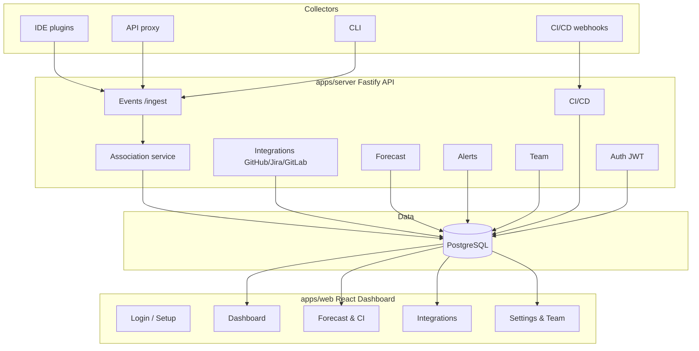

<p align="center">
  
</p>

# Burnwise

[](LICENSE)
[](https://github.com/filipjevtic/burnwise)

Self-hosted, open-source platform that turns AI usage into a first-class sprint-planning signal. Capture LLM tokens, traces, CI costs, and coding time from IDEs, API proxies, and CLI tools; associate them with Jira / GitHub / GitLab tickets; and forecast realistic workload, budget, and scope.

## What Burnwise does

- [x] **Capture effort signals** from IDE plugins, API proxies, CLI wrappers, and CI/CD pipelines.
- [x] **Associate events to tickets** by explicit ticket ID, prompt text, git branch, or commit message.
- [x] **Sync issue trackers** — GitHub Issues, Jira, and GitLab Issues become sprints and tickets.
- [x] **Forecast sprint capacity** from historical tokens, cost, and duration per story point.
- [x] **Track budgets and alerts** for tokens, cost, and CI spend per project and sprint.
- [x] **Manage teams and roles** — admin and member access control on every route.
- [x] **First-run setup wizard** — no seed data; create your workspace and admin account on first visit.
- [x] **Self-host in one command** with Docker Compose.

## Quick start

### Docker Compose (recommended)

```bash
# 1. Clone the repo
git clone https://github.com/filipjevtic/burnwise.git
cd burnwise

# 2. Set required environment variables
cp .env.example .env
# Edit .env — at minimum set JWT_SECRET to a random string

# 3. Start everything
docker compose up -d
```

Open http://localhost:8080. On first visit the **setup wizard** walks you through creating your workspace and admin account. Optionally load demo data from the dashboard once logged in.

### Local development

```bash
# Install dependencies
npm install

# Start Postgres
docker compose up -d postgres

# Push the schema (no migrations needed in dev)
npm run db:push --workspace=apps/server

# Start the server, proxy, and web dashboard in separate terminals
npm run dev --workspace=apps/server
npm run dev --workspace=apps/proxy
npm run dev --workspace=apps/web
```

Dashboard: http://localhost:5173 · API: http://localhost:3000 · Proxy: http://localhost:4000

For production deployment, see [docs/SELFHOST.md](docs/SELFHOST.md).

## Architecture

Burnwise is a monorepo of focused apps and packages.



For detailed diagrams and data model, see [docs/ARCHITECTURE.md](docs/ARCHITECTURE.md).

## Repository layout

| Path | Purpose |
|------|---------|
| `apps/web` | React dashboard (Vite + Tailwind + shadcn/ui) |
| `apps/server` | Fastify REST API, Prisma ORM, JWT auth, integrations |
| `apps/proxy` | OpenAI-compatible API proxy that emits events |
| `apps/cli` | Wrap commands and emit `session.activity` events |
| `apps/vscode` | VS Code extension collector |
| `apps/mcp` | MCP server for Claude Code and other MCP clients |
| `packages/schema` | Zod event schemas shared across apps |
| `docs/` | Architecture and self-hosting documentation |
| `docker-compose.yml` | One-command local stack |

## Environment variables

| Variable | Required | Description |
|----------|----------|-------------|
| `DATABASE_URL` | ✅ | PostgreSQL connection string |
| `JWT_SECRET` | ✅ | Secret used to sign auth tokens — use a long random string in production |
| `JWT_EXPIRY` | | Token lifetime (default: `7d`) |
| `INGEST_API_KEY` | ✅ | API key used by collectors to ingest events |
| `PORT` | | Server port (default: `3000`) |
| `VITE_API_URL` | | URL the browser uses to reach the server (default: `http://localhost:3000`) |

See `.env.example` for the full list including proxy and collector variables.

## Development

```bash
# Type-check everything
npm run typecheck --workspaces

# Build everything
npm run build --workspaces

# Run unit tests
npm run test --workspace=packages/schema

# Run E2E tests (requires server + web to be running, or uses webServer config)
npm run e2e --workspace=apps/web

# Run E2E in UI mode
npm run e2e:ui --workspace=apps/web
```

### First run (local dev)

After `npm run dev` starts the server and web app, open http://localhost:5173. The **setup wizard** will prompt you to create a workspace name and admin account. No seed data is loaded automatically — use the **"Explore with demo data"** button on the empty project screen to load sample sprints, tickets, and LLM events.

## Contributing

We welcome contributions. See [CONTRIBUTING.md](CONTRIBUTING.md) for guidelines.

## Security

To report a security vulnerability, please see [SECURITY.md](SECURITY.md).

## License

Apache 2.0 — see [LICENSE](LICENSE).