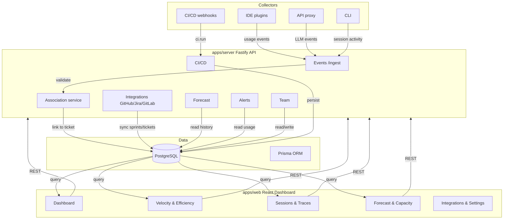
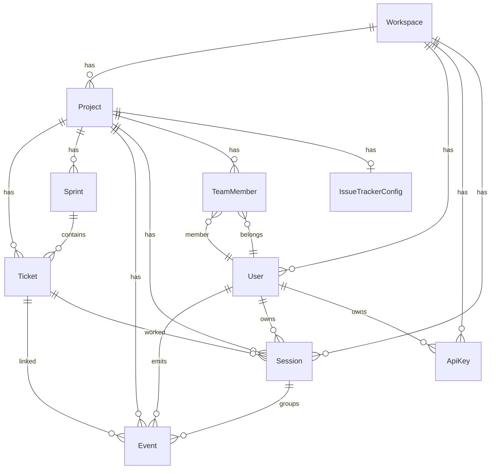
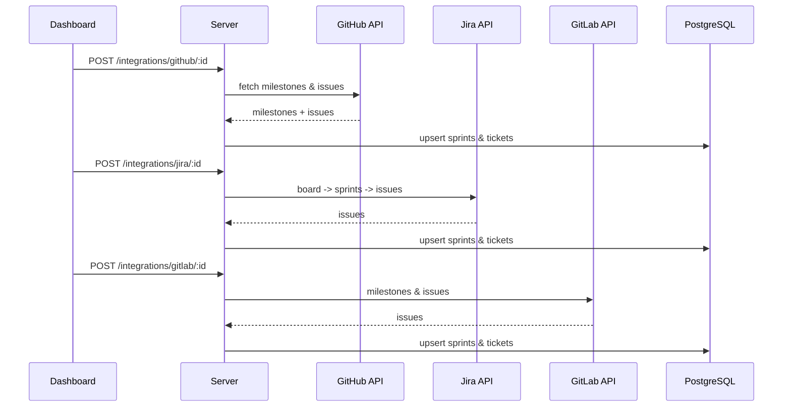
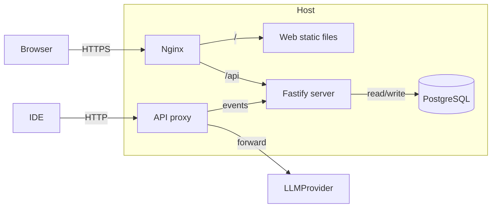

# Burnwise Architecture

  

This document describes the high-level architecture of the platform.

## System Overview

## Data Model

## Event Flow

1. A developer starts a **session** bound to a ticket (CLI `ats start`, MCP `set_ticket`, IDE, or git branch).
2. Collectors emit events (IDE, proxy, CLI, CI), authenticated with a personal **API key** (`bw_sk_...`) so the real user and workspace are resolved server-side.
3. The ingestion API validates the batch schema.
4. The association service links each event to a ticket by precedence: explicit session/header ticket > git branch convention > prompt/metadata extraction.
5. Events are persisted in PostgreSQL, grouped under their session.
6. The dashboard derives velocity (committed vs completed points), efficiency (effort per completed point), session/trace rollups, and a velocity-based capacity recommendation, all from the shared event-rollup math.

## Sprint-planning analytics

All analytics share one event-rollup helper so ticket, sprint, session, and developer summaries stay consistent:

- **Velocity**: committed vs completed story points, completion rate (estimate accuracy), and a trailing rolling average per sprint.
- **Efficiency**: cost / tokens / agent-time per completed story point, trended across sprints.
- **Capacity recommendation**: an anomaly-aware estimate (median ± 1 stddev of clean completed-points history) for the next sprint.

## Integration Flow

## Components

| Component | Location | Responsibility |
|-----------|----------|----------------|
| Web dashboard | `apps/web` | React UI, Tailwind + shadcn/ui |
| Server API | `apps/server` | Fastify REST API, Prisma, integrations |
| Proxy | `apps/proxy` | Forward LLM calls, emit events |
| CLI | `apps/cli` | Wrap commands, emit session activity |
| VS Code extension | `apps/vscode` | IDE collector |
| MCP server | `apps/mcp` | Ticket binding + activity for Claude Code / MCP clients |
| Schema | `packages/schema` | Zod event schemas |
| Pricing | `packages/pricing` | LLM cost lookup table |

## Deployment

See [SELFHOST.md](SELFHOST.md) for detailed deployment instructions.
